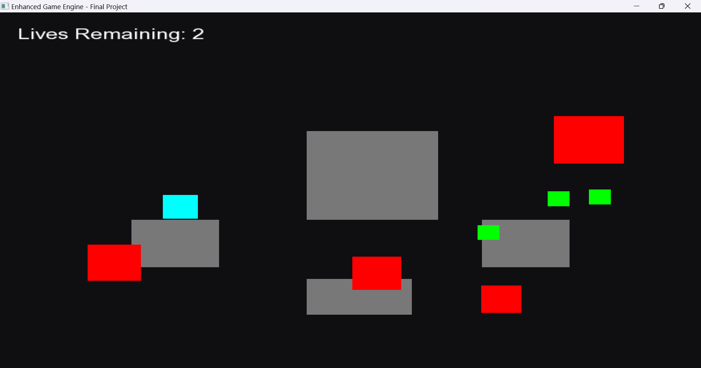

# Simple 2D Game Engine - 3rd Smester OOP Project



## Project Overview

This is an **Enhanced Game Engine** built in C++ using the **SFML (Simple and Fast Multimedia Library)** framework. It's a feature-rich 2D game that demonstrates object-oriented programming principles with a complete game loop, collision detection, audio/visual feedback, and an intuitive UI system.

The game is a survival-based gameplay experience where the player navigates obstacles while collecting power-ups to stay alive.

---

## Features

### 🎮 Core Gameplay
- **Player Character**: Controllable cyan square with smooth movement
- **Static Walls**: Gray obstacles that block player movement (4 permanent walls)
- **Dynamic Damage Walls**: Red squares that spawn randomly and reduce player lives (passthrough but damaging)
- **Power-ups**: Green squares that spawn randomly and increase player lives
- **Lives System**: Player starts with 0 lives and must collect power-ups to survive

### 🛡️ Advanced Mechanics
- **Invincibility Timer**: Player is protected for 1.5 seconds after taking damage
- **Blinking Animation**: Visual feedback when invincible (flickering effect)
- **Collision Detection**: Accurate rectangle-based collision system with push-out logic
- **Audio Feedback**: Sound effect plays when player hits obstacles

### 🎨 User Interface
- **Lives Display**: Real-time HUD showing lives remaining (top-left corner)
- **Game Over Screen**: Dark overlay with "GAME OVER!" message and options
- **Restart/Exit Options**: Press ENTER to restart or ESC to exit after game over
- **Professional Fonts**: Uses arial.ttf for text rendering

### 🔧 Technical Features
- **60 FPS Capped Rendering**: Smooth and consistent frame rate
- **Delta Time Updates**: Frame-rate independent game logic
- **Smart Object Management**: Automatic spawning and removal of game objects
- **Exception Handling**: Graceful error handling with try-catch blocks
- **Modular Design**: Separate classes for Player, DamageWall, PowerUp, and GameEngine

---

## System Requirements

### Minimum Requirements
- **OS**: Windows 10 or later
- **Compiler**: GCC/G++ (via MinGW or MSYS2)
- **C++ Standard**: C++17 or later
- **RAM**: 512 MB
- **Disk Space**: 500 MB (includes SFML library)

### Required Software
- **SFML 3.x** (Simple and Fast Multimedia Library)
- **GCC/G++** Compiler
- Standard C++ libraries

---

## Installation & Setup

### Step 1: Verify SFML Installation

The project includes SFML in the `SFML/` directory. Ensure the following structure exists:

```
Simple_Game_Engine/
├── SFML/
│   ├── include/
│   │   └── SFML/
│   │       ├── Graphics.hpp
│   │       ├── Audio.hpp
│   │       ├── Window.hpp
│   │       └── ... (other headers)
│   └── lib/
│       └── ... (compiled libraries)
├── main.cpp
├── output/
├── arial.ttf
└── hit.wav
```

### Step 2: Required Resource Files

Place the following files in the project root directory:

- **arial.ttf**: Font file for text rendering
  - Required for UI text (lives display, game over message)
  - If missing, the game will still run but won't display text
  
- **hit.wav**: Audio file for collision sound
  - Required for audio feedback when hitting obstacles
  - If missing, the game will run silently but warn about missing audio

> You can obtain these files from:
> - arial.ttf: Windows System Fonts folder or any free TTF font
> - hit.wav: Any short sound effect file (WAV format)

### Step 3: Create Output Directory

Ensure the `output/` directory exists:
```bash
mkdir output
```

This directory stores the compiled executable.

---

## Building the Project

### Option 1: Using VS Code Build Task (Recommended)

1. Open the project in VS Code
2. Press `Ctrl + Shift + B` or go to **Terminal → Run Build Task**
3. Select **"C++ Build with SFML"**
4. The executable will be compiled to `output/main.exe`

### Option 2: Manual Compilation via Terminal

Navigate to the project directory and run:

```bash
g++ -Wall -Wextra -g3 -I./SFML/include main.cpp -o output/main.exe -L./SFML/lib -lsfml-graphics -lsfml-audio -lsfml-window -lsfml-system
```

**Build Command Explanation:**
- `-Wall -Wextra`: Enable all compiler warnings
- `-g3`: Include debug symbols for debugging
- `-I./SFML/include`: Add SFML include directory
- `-L./SFML/lib`: Add SFML library directory
- `-lsfml-graphics`: Link SFML Graphics module (rendering)
- `-lsfml-audio`: Link SFML Audio module (sound effects)
- `-lsfml-window`: Link SFML Window module (game window)
- `-lsfml-system`: Link SFML System module (time, vectors, etc.)

### Build Output

If successful, you'll see:
```
output/main.exe
```

If there are errors, check:
- SFML include path is correct
- SFML libraries are in the `SFML/lib/` directory
- Font and audio files are in the project root

---

## Running the Game

### Option 1: Using VS Code Run Task (Recommended)

1. Press `Ctrl + Shift + D` or go to **Terminal → Run Task**
2. Select **"Run Game"**
3. The game will automatically build and execute

### Option 2: Direct Execution

Navigate to the project directory and run:

```bash
./output/main.exe
```

Or from Windows Command Prompt:
```cmd
.\output\main.exe
```

### Expected Output

Upon successful launch, you should see:
- A **800x600 pixel** window titled "Enhanced Game Engine - Final Project"
- A **dark background** (RGB: 15, 15, 18)
- A **cyan square** (your player character) at the top-left
- **4 gray rectangular obstacles** scattered across the screen
- **"Lives Remaining: 0"** text in the top-left corner
- **Green squares** appearing periodically (power-ups)
- **Red squares** appearing periodically (damage walls)

---

## Gameplay Guide

### Controls

| Key | Action |
|-----|--------|
| **W** | Move UP |
| **A** | Move LEFT |
| **S** | Move DOWN |
| **D** | Move RIGHT |
| **ENTER** | Restart Game (when game is over) |
| **ESC** | Exit Game (when game is over) |

### Game Mechanics

#### Player (Cyan Square)
- **Movement Speed**: 350 pixels/second
- **Size**: 40×40 pixels
- **Starting Position**: Top-left (50, 50)

#### Static Walls (Gray Rectangles)
- **Purpose**: Block player movement
- **Interaction**: Player cannot pass through; pushes player out
- **Quantity**: 4 permanent walls at fixed locations
- **Damage**: None

#### Damage Walls (Red Squares)
- **Purpose**: Deal damage while allowing passage
- **Interaction**: Player can move through but loses 1 life
- **Damage**: 1 life per collision
- **Spawn Rate**: Every 2.5 seconds (max 4 on screen)
- **Size**: 40-80 pixels (randomized)

#### Power-ups (Green Squares)
- **Purpose**: Increase player lives
- **Interaction**: Collect by touching
- **Effect**: Adds 1 life
- **Spawn Rate**: Every 3 seconds (max 3 on screen)
- **Size**: 25×25 pixels

### Invincibility System

When the player takes damage:
1. **Life reduced by 1**
2. **Invincibility timer starts** (1.5 seconds)
3. **Player blinks** (flickers on/off)
4. **No damage can be taken** during blinking period
5. **After 1.5 seconds**, invincibility ends and player becomes vulnerable again

### Winning & Losing

**Game Over Condition:**
- Player loses all lives (lives reach 0)
- Game freezes and shows game over screen

**Game Over Screen:**
- Semi-transparent dark overlay covers the game
- "GAME OVER!" message in large red text
- Instructions: "PRESS ENTER TO RESTART" or "PRESS ESC TO EXIT"

**Strategy:**
- Collect power-ups (green) to survive longer
- Avoid damage walls (red) or plan your route
- Use invincibility timer tactically
- Navigation around static walls is key to survival

---

## Project Structure

```
Simple_Game_Engine/
│
├── main.cpp                        # Main game engine source code
│
├── output/
│   └── main.exe                    # Compiled executable (generated)
│
├── SFML/                           # SFML Library (included)
│   ├── include/
│   │   └── SFML/
│   │       ├── Graphics.hpp        # Graphics rendering
│   │       ├── Audio.hpp           # Sound & music
│   │       ├── Window.hpp          # Window & events
│   │       ├── System.hpp          # System utilities
│   │       └── ... (other headers)
│   └── lib/
│       └── (Compiled SFML libraries)
│
├── arial.ttf                       # Font file (required)
├── hit.wav                         # Sound effect (optional)
├── README.md                       # This file
└── .vscode/
    └── tasks.json                  # VS Code build tasks
```

### Key Classes

#### `Player`
- Represents the controllable character
- Handles movement, collision, and invincibility logic
- Manages audio feedback for collisions
- **Key Methods**:
  - `update(float dt)`: Update player position and animation
  - `handleCollision(const sf::RectangleShape&)`: Handle wall collisions
  - `addLife()`: Increase lives by 1
  - `isAlive()`: Check if game is active

#### `DamageWall`
- Represents passthrough damaging obstacles
- Spawns at random locations
- Can be passed through but reduces lives
- **Key Methods**:
  - `checkCollision()`: Detect player contact
  - `resetHitFlag()`: Reset hit detection each frame
  - `getDamage()`: Return damage amount

#### `PowerUp`
- Represents collectible life-boosting items
- Spawns at random locations
- Disappears when collected
- **Key Methods**:
  - `checkCollision()`: Detect player collection
  - `isCollected()`: Check if already picked up

#### `GameEngine`
- Main game controller managing all game logic
- Handles spawning, rendering, and game state
- **Key Methods**:
  - `run()`: Main game loop
  - `spawnPowerUp()`: Create new power-up
  - `spawnDamageWall()`: Create new damage wall
  - `restartGame()`: Reset game state
  - `drawGameOverScreen()`: Render end screen

---

## Dependencies

### SFML Modules Used

| Module | Purpose | Usage |
|--------|---------|-------|
| **Graphics** | 2D rendering (shapes, text) | Draw walls, player, text |
| **Audio** | Sound effects | Collision sound effect |
| **Window** | Window & event handling | Game window, keyboard input |
| **System** | Utility classes | Vectors, clocks, timing |

### Standard C++ Libraries

- `<vector>`: Store walls, power-ups, damage walls
- `<memory>`: Smart pointers (unique_ptr)
- `<cmath>`: Vector normalization calculations
- `<iostream>`: Console output (warnings)
- `<string>`: Text formatting
- `<random>`: Random number generation
- `<algorithm>`: Vector operations (erase, remove_if)

---

## Troubleshooting

### Build Issues

**Error: "cannot find -lsfml-graphics"**
- Solution: Ensure SFML/lib directory contains compiled libraries
- Check that the path `-L./SFML/lib` is correct

**Error: "SFML/Graphics.hpp: No such file or directory"**
- Solution: Verify SFML/include/SFML/ directory structure
- Use `-I./SFML/include` in compiler flags

**Error: "undefined reference to sf::..."**
- Solution: Rebuild with all required SFML library links
- Ensure `-lsfml-graphics`, `-lsfml-audio`, `-lsfml-window`, `-lsfml-system` are all included

### Runtime Issues

**Game window doesn't open**
- Check if VS Code terminal has permissions
- Try running from Command Prompt with admin privileges
- Ensure graphics drivers are up to date

**No audio when hitting obstacles**
- Warning: "Could not load hit.wav sound!" means file is missing
- Solution: Place a hit.wav file in the project root directory
- Game still runs without audio

**Text doesn't display**
- Warning: "Could not load arial.ttf!" means font is missing
- Solution: Place arial.ttf in the project root directory
- Game still runs without text display

**Game runs slowly (below 60 FPS)**
- Close other applications consuming CPU/GPU
- Check system resources (RAM, CPU)
- SFML should run smoothly on any modern system

---

## Features Explained in Detail

### Collision Detection System

The game uses **SFML's `getGlobalBounds().findIntersection()`** method:

```cpp
auto intersect = shape1.getGlobalBounds().findIntersection(shape2.getGlobalBounds());
if (intersect) {
    // Collision detected
}
```

**Wall Collision Handling:**
- If player overlaps with wall, they are pushed out
- Push direction determined by smallest overlap dimension
- Prevents player from getting stuck inside obstacles

**Power-up Collection:**
- Automatically marked as collected
- Removed from game world next frame
- Increases player lives by 1

**Damage Wall Interaction:**
- Player can pass through but takes damage
- Hit flag prevents multiple hits in same frame
- Invincibility system prevents life loss during protection period

### Spawn System

**Power-ups:**
- Spawn every 3 seconds
- Maximum 3 on screen simultaneously
- Random position: (50-750, 100-550)

**Damage Walls:**
- Spawn every 2.5 seconds
- Maximum 4 on screen simultaneously
- Random position: (50-700, 100-500)
- Random size: 40-80 pixels

### Frame-Rate Independent Updates

All game logic uses **delta time (dt)** for frame-rate independence:

```cpp
m_shape.move((direction / length) * m_speed * dt);
// Same movement speed regardless of FPS
```

This ensures consistent gameplay at any frame rate.

---

## Advanced Concepts Demonstrated

### Object-Oriented Programming
- **Encapsulation**: Private member variables with public methods
- **Inheritance**: N/A (could be extended)
- **Polymorphism**: N/A (could be extended)
- **Composition**: GameEngine contains Player, Walls, PowerUps

### Design Patterns
- **Smart Pointers**: `unique_ptr` for automatic memory management
- **Vector Containers**: Dynamic storage of game objects
- **State Machine**: Game over state vs. gameplay state

### Performance Optimization
- **Object Pooling**: Reusing collision detection objects
- **Lazy Removal**: Marking objects for deletion before removal
- **Spatial Organization**: Simple position-based logic

---

## Future Enhancement Ideas

1. **Multiple Levels**: Different wall layouts and difficulties
2. **Enemy AI**: Moving obstacles with simple pathfinding
3. **Scoring System**: Points based on time survived
4. **Visual Effects**: Particle systems for collisions
5. **Music**: Background music during gameplay
6. **Difficulty Scaling**: Increased spawn rates over time
7. **Leaderboard**: Track high scores
8. **Power-up Varieties**: Different effects (speed boost, invincibility, etc.)

---

## Credits

- **Engine**: SFML 3.x (Simple and Fast Multimedia Library)
- **Language**: C++17
- **Course**: Object Oriented Programming - Final Project
- **University**: BSCS Program

---

## License

This project is part of an academic assignment. Use for educational purposes only.

---

## Support & Questions

For issues or questions:
1. Check the **Troubleshooting** section
2. Verify SFML installation and file paths
3. Ensure all required files (arial.ttf, hit.wav) are present
4. Review the code comments in main.cpp for implementation details

---

**Last Updated**: January 25, 2026  
**Project Status**: Complete & Fully Functional
